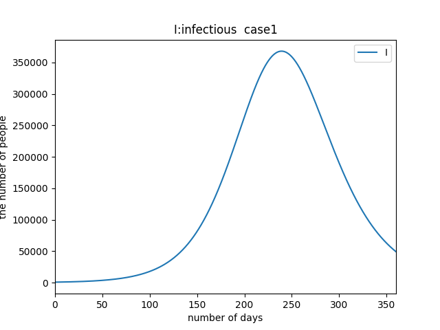
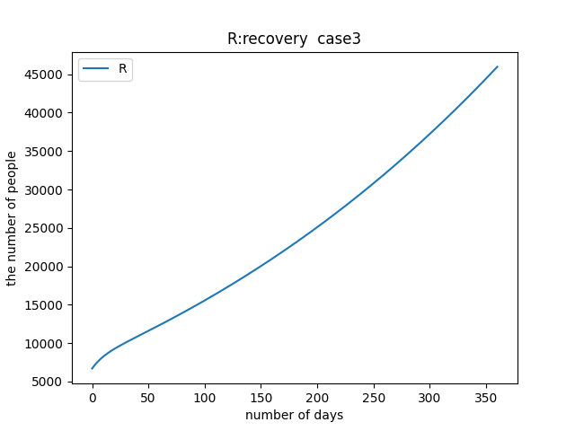
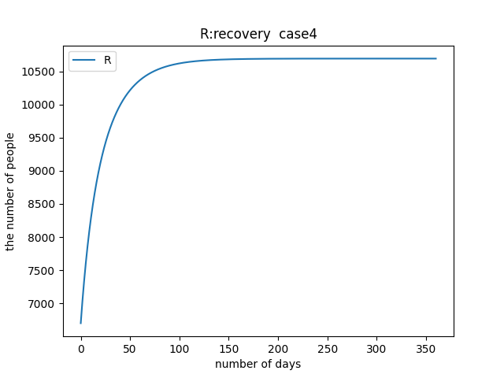

# New SIQRmodel for COVID-19

SIQRモデルによる分析により, 7.16.2020現在での新型コロナウイルス感染症の今後の感染拡大の予想とそれを抑える有効な政策を提案する. 

## SIQR model

SIQRモデルはSIRモデルという疫学における区画モデルの発展型とされる数理モデルである. 主にSIRモデルは感染症のシミュレーションに用いられるが、SNSの拡散モデルなど幅広い汎用例がある. 
今度の感染症の感染拡大のシミュレーションでは全人口を、「未感染者(susceptible)」「市中感染者(infectious)」「隔離感染者(quarantine)」「治癒者/死亡者(recovery)」という４つのパートに分けてこれらの人口の移動を考える. 

小田垣論文では, 以下のようなモデルが提唱されている.

Sは市中感染者, Iは市中感染者, Qは隔離感染者, Rは快復者及び死亡者である. βは市中感染者と未感染者の全ての接触のうち感染する確率を表し, 未感染者は(1-q)βSIが市中感染者となり, 残りのqβSIは隔離感染者となるとしている. γは市中感染者の治癒率であり感染から治癒の期間の逆数とし, γ'は隔離感染者の治癒率であり発症から治癒の期間の逆数としている.ここでは[小田垣教授の論文の読み方](https://kichiro-talk.hatenablog.com/entry/2020/05/27/182644)より感染力を持つのは感染から発症までおよそ5日, 発症後のおよそ7日としている. すなわちγ=1/12, γ'=1/10とした. 発症が確認されれば感染力が咳などの症状の影響で感染リスクが拡大すると仮定して発症後の感染力を持つ期間を10日と独自に仮定した.

しかしこれでは未感染者から隔離感染者にフローが存在していて, これは矛盾が生じることになる. COVID-19は未発症でも感染者は感染力を保持, 未発症のまま治癒することもあるため, 任意の感染者は一旦は市中感染者となる. すなわち以下のようなモデルが望ましいと考えられる. 

これをシミュレートし, 分析を試みた.

## Simulation
常微分方程式の数値計算には`scipy.odeint`を使用した. 数値解法はadams法(どのそれかは不明)である.

初期値は7.16.2020現在の[東京都新型コロナウイルス感染症対策サイト](https://stopcovid19.metro.tokyo.lg.jp/)の値を参考に概算で出したものを使用した.

|S|Q|I|R|
| --- | --- | --- | --- |
|9990900(人)|700(人)|1500(人)|6700(人)|

期間は360日であり, 
接触率は[小田垣](http://mercury.yukawa.kyoto-u.ac.jp/~bussei.kenkyu/wp/wp-content/uploads/2020-082101v3.pdf)を参考にし, これからし得る政策とその基準を5ケースに分けた.
感染者の数が人口に対して非常に少ないため, ここでは感染者と快復者のグラフを示す.

#### case1
陽性者隔離率1％, 接触率12.6% (3月基準)
これからPCR検査率を下げ、接触率を下げる努力もしなかった場合

#### case2
陽性者隔離率5％, 接触率12.6% (3月基準)
PCR検査率を上げる努力をし, 接触率を下げる努力をしなかった場合.

#### case3
陽性者隔離率1％, 接触率9.6% (5月基準)
PCR検査率をあげる努力をせず, 外出自粛により接触率を下げた場合.

#### case4
陽性者隔離率5％, 接触率9.6% (5月基準)
PCR検査率をあげる努力をし, 外出自粛により接触率を下げた場合.

#### case5
陽性者隔離率8％, 接触率12.6% (3月基準)
PCR検査率をあげる努力をし, 外出自粛をせずにcase4の値を目指した場合.

## Analysis
case1は基本的にわずかな陽性者を隔離するにとどまる政策を想定しているので, 当然感染は拡大し, 一時東京都の感染者数は35万人になることが予想される. 
残りのケースに関してはcase3とcase2, case4, case5の2つに分けられる. case3は外出自粛により接触率を下げた場合であり, 陽性者を検査によりたくさん見つけ, 隔離する政策を取らない場合である. case2~case5のうち, case3は唯一グラフの概形が異なっていて, __感染者数が増え続けていて, 収束に向かう形を全くしていない.__  1年経ってもまだまだ感染者は増え続けるということである. よって感染収束に対して __最も効率的な政策は隔離政策である.__  PCR検査を行い陽性者の発見を急ぐべきである. _外出自粛による接触率低下は優先されるものではない._

また, 実際の感染はクラスター感染などと呼ばれるように感染経路にはある程度偏りがあるとされている. ある人口密集グループ内に1人の感染者がいて感染を広げる確率はそのグループ内の人口とその密度に依存する. すなわちフェスや大規模ライブのようなものは感染確率が上がるということであるので, 避けられるのであれば避けたほうが良い. しかし経済との兼ね合いなどもあるため, 小中規模のオフィスや飲食店は営業を再開すべきであろう. 都市封鎖などの政策は感染初期には有効だが, ある程度感染が広がった段階ではあまり意味がないことはcase3から予想される.

# reference
1. [新型コロナウイルスの蔓延に関する一考察](http://www001.upp.so-net.ne.jp/rise/images/%E6%96%B0%E5%9E%8B%E3%82%B3%E3%83%AD%E3%83%8A%E4%B8%80%E8%80%83%E5%AF%9F.pdf)

2. [新型コロナウイルス感染症のSIQRモデルからわかることー小田垣教授の論文の読み方](https://kichiro-talk.hatenablog.com/entry/2020/05/27/182644)

3. [The SIR Model for Spread of Disease - The Differential Equation Model](https://www.maa.org/press/periodicals/loci/joma/the-sir-model-for-spread-of-disease-the-differential-equation-model)

4. [東京都新型コロナウイルス感染症対策サイト](https://stopcovid19.metro.tokyo.lg.jp/)

5.  [SIQR モデルの表示 - Qiita](https://qiita.com/ekzemplaro/items/d4b079da3f172f6535b9)

